# Samenvatting CNII
|   Inhoudstafel    |
| :---  |
| 1.[Basic Device Configuration](#module-1--basic-device-configuration)
| 2.[Switching Concepts](#module-2-switching-concepts)
| 3.[VLANs](#module-3-vlans)
| 4.[Inter-VLAN-routing](#module-4-inter-vlan-routing)
| 5.[STP Concepts](#module-5-stp-concepts)
| 6.[Etherchannel](#module-6-etherchannel)
| 7.[DHCPv4](#module-7-dhcpv4)
| 8.[SLAAC and DHCPv6](#module-8-slaac-and-dhcpv6)
| 9.[FHRP Concepts](#module-9-fhrp-concepts)
| 10.[LAN Security Concepts](#module-10-lan-security-concepts)
| 11.[Switch Security Configuration](#module-11-switch-security-configuration)

# Module 1 – Basic Device Configuration
## Configure a Switch with Initial Settings
### 1.1.1 Switch Boot Sequence

Bij het opstarten van een switch doorloopt deze een 5-stappige Boot Sequence:

1. Power-on Self Test (POST)
2. Boot loader software laten draaien.
3. BL presteert draait een low-level CPU initialisatie.
4. BL initialiseert van the flash file system.
5. BL zoekt en laadt een default IOS software image op de memory, geeft de controle van de switch over naar de IOS

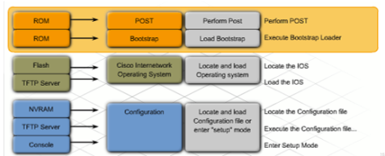

### 1.1.2 The boot system Command

De switch probeert automatisch te booten met de informatie dat is gezet op de BOOT environment variable. Default: de switch probeert het eerste uitvoerbare file te vinden, te laden en uit te voeren.

Hierna zorgt IOS voor de initialisatie van de interfaces via de Cisco IOS commands dat hij vind in de startup-config file (gelocaliseerd in de flash)

In dit voorbeeld, zie tabel.

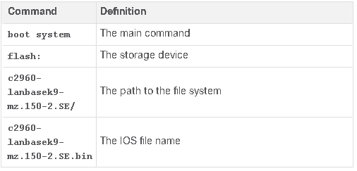

### 1.1.3 Switch Led Indicators

Cisco Catalyst switches hebben 6 LED indicator lights. Deze staan op het voorpaneel van de switch.

- **System LED (SYST)**: toont of het system power krijgt en deze naar normale functionaliseert.
- **Redundant Power Supply LED (RPS)**: toont de RPS status.
- **Port Status LED (STAT)**
- **Port Duplex LED (DUPLX)**
- **Port Speed LED (SPEED)**
- **Power over Ethernet LED (PoE)**

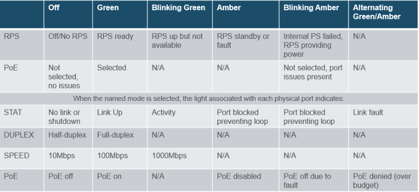

### 1.1.3 Recovering from a System Crash

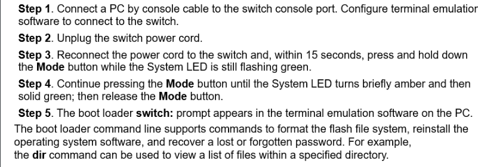

### 1.1.5 Switch Management Access

Om switch voor te bereiden op remote management access, moet de SVI (Switch Virtual Interface) geconfigueerd worden met een IPv4 adres en subnet mask of IPv6 adres en prefix lengte. Als he van een andere netwerk komt moet er ook een default gateway ingesteld worden.

## 1.2 Configure Switch Ports
### 1.2.1 Duplex Communication

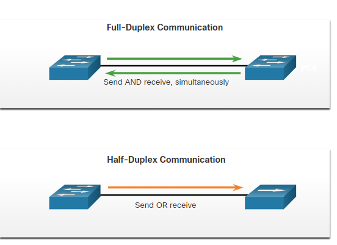

Full – duplex: vergroot de bandbreedte efficientie, bidirectionele communicatie

Half-duplex: unidirectionele communicatie,creeert performantie problemen doordat er een botsing kan ontstaan tussen de pakketten (Meestal gezien in oudere apparaten).

- Gigabitethernet en 10 gb NIC’s hebben full-duplex communicatie nodig op te werken, de botsing detective systeem is uitgeschakeld en geeft 100% efficientie in beide richtingen (ontvangen en sturen) => geeft een verdubbeling van het potentiele gebruik van de bandbreedte.

### 1.2.2 Configure Switch Ports at the Physical Layer

- switch poorten kunnen manueel aangepast worden, zowel voor de duplex- en de snelheidinstellingen.
    - Duplex: via de interface duplex
    - Speed: via interface speed
- Default is de setting overal auto

### 1.2.3 Auto-MDIX

=> via het gebruik van auto-MDIX, kan de switch het type van communicatie zelf gaan detecteren en bepalen.

Commando mdix auto in de globale configuratie

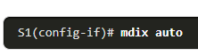

### 1.2.4 Switch Verification Commands


### 1.2.5 Verify Switch Port Configuration

- `show running-config`, kan gebruikt worden om te controleren of de switch correct geconfigueerd is
- `show interfaces`
- `show interfaces fastEthernet 0/18`

### 1.2.6 Network Access Layer Issues

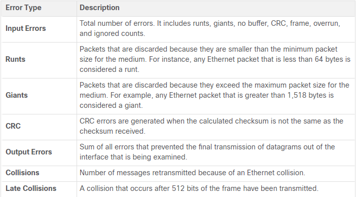

De mogelijke errors code dit kunnen oplopen bij het commando show interfaces.

### 1.2.7 Interface Input and Output Errors

- aangegeven input erros bij het uitvoeren van het show interfaces commando
    - Runt Frames
    - Giants
    - CRC errors
- Output errors
    - Collisions
    - Late collisions

### 1.2.8 Troubleshooting Network Access Layer Issues

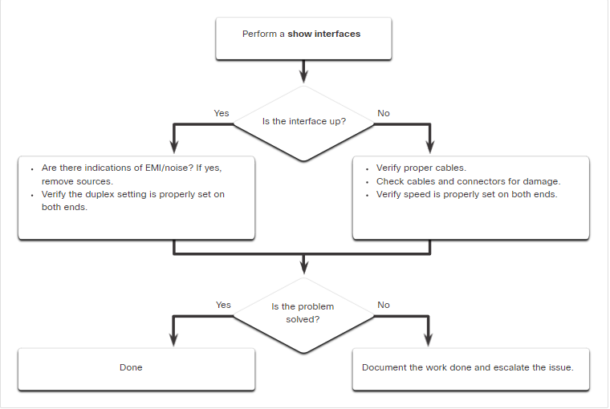

## 1.3 Secure Remote Access
### 1.3.1 Telnet Operation

- gebruikt TCP poort 23
- ouder protocol
- gebruikt onbeveiligde plaintext communicatie (voor zowel de username als het wachtwoord)

### 1.3.2 SSH Operation

- Secure Shell
- Gebruikt TCP poort 22
- Gebruikt geëncrypteerde communcatie

### 1.3.3 Verify the Switch Supports SSH

- `show version`

### 1.3.4 Configure SSH

1. Kijken of switch SSH supports
    1. `show ip ssh`
2. IP domein configuren
    1. `ip domain-name <domeinnaam>`
3. RSA sleutel paar aanmaken
    1. Crypto key generate rsa
        1. Met 1024 bits
        2. Kan verwijderd via crypto key zeroize rsa in globale configuratie
4. User authenticatie instellen
    1. `username <username> secret <wachtwoord>`
5. vty lijnen instellen
    1. 
        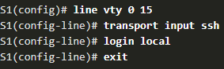
        
6. SSH version 2 aanzetten
    1. `ip ssh version 2`

## 1.4 Basic Router Configuration
### 1.4.1 Configure Basic Router Settings

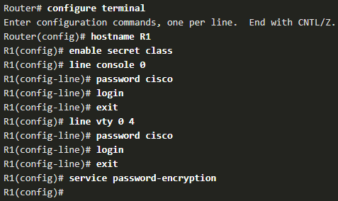

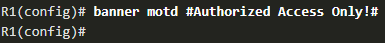

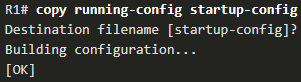

### 1.4.3 Dual Stack Topology

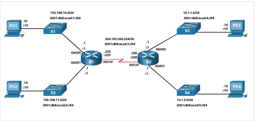

### 1.4.4 Configure Router Interfaces

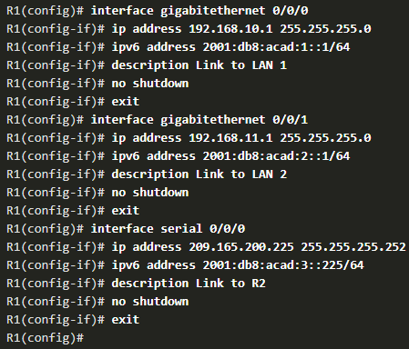

### 1.4.6 IPv4 Loopback Interfaces

- loopback interface = logische interface in the router, is niet aangewezen aan een fysische poor ten kan nooit geconnecteerd worden aan een ander device.
    - Het is een software interface die automatisch ‘up’ staat zolang de router functioneel is
- Gemakkelijk om het apparaat te testen of deze perfect is geïnitialiseerd
- Het aanzetten en het geven van een loopback adres
    - 
        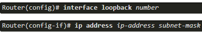
        
## 1.5 Verify Directly Connected Networks
### 1.5.1 Interface Verification Commands

- Heel gemakkelijk via bepaalde show commands
    - `show ip interface brief` / `show ipv6 interface brief`
    - `show running-config interface <interface-id>`
    - `show ip route / show ipv6 route`

### 1.5.2 Verify Interface Status
- `show ip interface brief`
- `show ipv6 interface brief`

### 1.5.3 Verify IPv6 Link Local and Multicast Addresses
- `show ipv6 interface <interface-name>`

### 1.5.4 Verify Interface Configuration
- `show running-config interface <interface-name>`
- meer gedetaileerde interface info
  - `show interfaces`
  - `show ip interface`
  - `show ipv6 interface`

### 1.5.5 Verify Routes
- `show ip route`
- `show ipv6 route`
- `ping <ip-adres>`

### 1.5.6 Filter Show Command Output
- section
- include
- exclude
- begin

### 1.5.8 Command History Feature
- `show history`
- `terminal history size <grootte>`

# Module 2: Switching Concepts
## 2.1 Frame Forwarding
### 2.1.1 Switching in Networking

- begrippen die geassocieerd zijn met het binnenkomen en weggaan van frames uit een device
    - Ingress: de poort waar de frame in het apparaat binnenkomt
    - Egress: de poort die gebruikt wordt op het apparaat te verlaten
- Het forwarden van een frame gebeurt op basis van de ingress interface & het MAC adres van de bestemming
- De switch gebruikt de MAC adres tabel om forwarding beslissingen te nemen.
- !!! een frame zal NOOIT geforward worden uit dezelfde poort waar het op de switch het ontvangen heeft.

### 2.1.2 The Switch MAC Address Table

- Switch zal de bestemming MAC adres gebruiken om de egress interface te achterhalen.
- ook Content Addressable Memory (CEM) table genoemd

### 2.1.3 The Switch Learn and Forward Method

Een frame volgt een twee-stappig proces wanneer deze binnenkomt in een switch:

- **Stap 1: LEARN** : het MAC adres van de bron onderzoeken
    - Ieder pakket wordt bekeken of er nieuwe informatie te leren valt
        - Bron MAC adres staat niet in de tabel: het MAC adres en de bijhorende poortnummer wordt in de tabel gestoken
        - Bron MAC adres staat wel in de tabel: timer wordt gereset
- **Stap 2: Forward:** het MAC adres van de bestemming onderzoeken:
    - als het MAC adres een unicast adres is, wordt er in de tabel gekeken of er een match is:
        - als deze er is de frame wordt geforward naar de specifieke poort
        - als deze er niet is
            - switch forward de frame naar iedere poort buiten de inkomende poort ( = unknown unicast) (voor unicast adressen)
            - broadcast en multicast wordt iedere poort geflood maar niet de inkomende poort

### 2.1.5 Switching Forwarding Methods

Switch maakt Layer 2 forward beslissing heel snel, dit komt door software op ASICs (Application-Specific-Integrated Circuits.

- De Switch heeft hiervoor 2 methodes:
    - **Store-and-Forward switching**: de beslissing wordt genomen achter dat de VOLLEDIGE frame ontvangen werd en hij geen errors heeft (dit met het CRC). Cisco’s primaire switching methode
    - **Cut-Through switching**: het forwarding proces begint achter de het bestemming MAC adres en de egress port beslist zijn.

### 2.1.6 Store-and-Forward Switching

- Heeft 2 primaire karakteristieken:
    - Er wordt gecheckt voor errors: de frame wordt pas geforward als hij vrij is van errors anders word de frame gedropped.
    - Automatisch bufferen

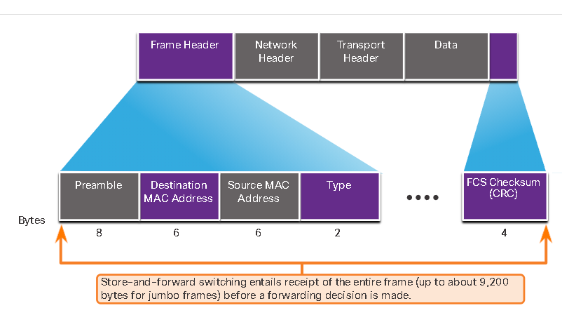

### 2.1.7 Cut-Through Switching

- Kan heel snel forward beslissingen nemen, direct achter het vastleggen van de bestemming MAC.
- Concepten van CTS
    - Latency kan onder 10 micorseconden zijn
    - Check de FCS niet
    - Kan de bandbreedte problemen opnemen
    - Kan geen poorten ondersteunen met verschillende snelheden tussen ingress naar egress

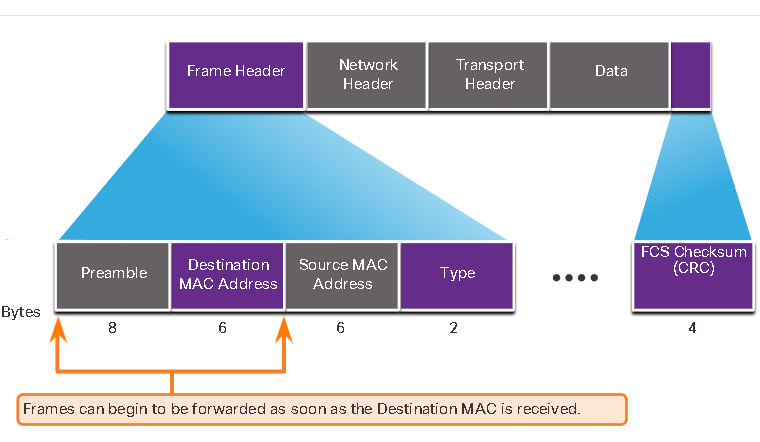

## 2.2 Collision and Broadcast Domains
### 2.2.1 Collision Domains

- Collision domeinen = netwerk segmenten dat dezelfde bandbreedte delen
    - Als er 2 of meerdere apparaten op hetzelfde collision domein proberen te communiceren op hetzelfde moment, dan zal er een botsing zijn
- Als een switch in full-duplex werkt, zal er geen collision domain zijn
    - Maar wel als er een poort in half-duplex werkt, als deze hierin functioneert heeft ieder segment zijn eigen collision domain
- Default: de switch en het apparaat waaraan het geconnecteerd is zullen samen overleggen want ze zullen doen (zowel duplex als speed), ze zoeken de hoogst en best mogelijkste (full & 1000 Mbps)

### 2.2.2 Broadcast Domains

- = een collectie van intergeconnecteerde switches
    - Enkel een netwerk laag apparaat (router) kan een laag 2 broadcast domein verdelen
    - Router kunnen gebruikt worden om broadcast en collision domeinen te segmenteren
- Een laag 2 broadcast domein = de MAC adres broadcast domein.
    - Dit bestaat uit alle apparaten die op de LAN verbonden zijn en ontvangen broadcast frames van de host
- Broadcasts zijn nodig voor om apparaten en netwerkservices te lokaliseren op het netwerk, kunnen ook netwerk efficiëntie doen verlagen
    - Te veel broadcasts kunnen leiden tot netwerkopstoppingen verlagen de netwerk performantie
- Wanneer er 2 switches geconnecteerd worden aan elkaar broadcast domein wordt vergroot

### 2.2.3 Alleviate Network Congestion

- Karakteristieken van switches om netwerkopstoppingen te vermijden
    - **Hoge poortsnelheden**
    - **Fast internal swichting:** gebruik van een snel internal bus of gedeeld geheugen, geven hogere performantie
    - **Grote frame buffers:** hierdoor kan er ingress van een snellere poort geforward worden naar een tragere egress poort zonder frames te verliezen
    - **Hoge poort densiteit:** dit verminderd het aantal switches nodig, zorgt ervoor dat de traffic lokaal blijft

# Module 3 VLANs
## 3.1 Overvieuw of VLANs
### 3.1.1 VLAN Definitions

- VLANs = logische connecties met dezelfde apparaten
- heeft de volgende eigenschappen:
    - geeft segmentatie van verschillende groepen van apparaten op dezelfde switches
    - geeft een organisatie die beter de managen is
        - broadcasts, multicasts and unicasts zijn geïsoleerd in een VLAN
        - iedere VLAN heeft zijn eigen unieke range van IP adressen
        - kleinere broadcast domeinen

### 3.1.2 Benefits of a VLAN Design
|Voordeel   | Beschrijving      |
|:---       | :---              |
|**kleinere broadcast domeinen** | de LAN verdelen, verminderd de aantal apparaten in een broadcast domein   |
|**verbeterde beveiliging** | alleen users uit dezelfde VLAN kunnen met elkaar communicern|
|**verbeterde IT efficiëntie**  | VLANs kunnen apparaten groepen met dezelfde functionaliteiten|
|**verminderde kosten** | 1 switch kan meerdere groepen van VLANs supporten |
|**betere performantie**    | kleinere broadcast domeinen, verminderen traffic en verbeteren de bandbreedte |
|**simpelere management**   |dezelfde groepen zullen de dezelfde applicaties en andere network nodigheden |

### 3.1.3 Types of VLANs

- Default VLAN
    - kan niet verwijderd worden
- Data VLAN
    - is voor gebruiker-gemaakt traffic (email & web traffic)
- Native VLAN
    - trunk links alleen voor untagged frames
    - alle frames zijn getagged op een 802.1Q trunk link, behalve die op de native VLAN
- Management VLAN
    - gebruikt voor SSH connecties
    - is meestal de SVI voor de Layer 2 Switch
- Voice VLAN
    - is nodig omdat Voice traffic heeft deze dingen nodig:
        - verzekerde bandbreedte
        - hoge Quality of Service kwaliteit
        - vertraging van minder dan 150 ms tussen bron en bestemming
        - de mogelijkheid om opstoppingen te voorkomen
    - het hele netwerk moet gemaakt zijn om voice te supporten

## 3.2 VLANSs in a Multi-Switched Environment

### 3.2.1 Defining VLAN Trunks

- trunk = een punt-tot-punt link tussen 2 netwerk apparaten
- Cisco trunk functies:
    - meer VLAN supporten
    - VLAN vergroten tot het volledige netwerk
    - default: supports alle VLANs
    - supports 802.1Q trunking

### 3.2.2 Networks without VLANs

- zonder VLANs zullen alle apparaten die verbonden zijn aan de switches alle unicast, multicast en broadcast berichten

### 3.2.3 Networks with VLANs

- zonder een Layer 3 apparaat om de VLANs te verbinden met elkaar, de apparaten in  andere VLANs kunnen niet communiceren

### 3.2.4 VLAN Identification with a Tag

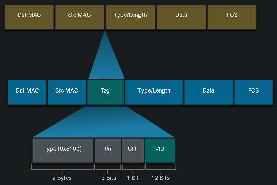

- IEEE 802.1Q header is 4 bytes
- wanneer de tag gemaakt moet de FCS opnieuw uitgerekend worden
- wanneer het verzonden wordt naar een end-apparaat, de tag moet verwijderd worden & de FCS moet opnieuw uitgerekend worden naar zijn origineel nummer

|802.1Q VLAN Tag Field  | Functie   |
|:---                   |:---       |
|**Type**                   | 2-Byte veld met hexadecimaal 0X8100, = Tag Protocol ID (TPID) |
|**User Priority**          | 3-bit waarde dan de level van service implementatie ondersteunt   |
|**Canonical Format Identifier (CFI)**  | 1 bit waarde die token ring frames ondersteunt op Ethernet    |
|**VLAN ID (VID)**  | 12 bit VLAN identifier dat tot 4096 VLANs kan ondersteunen    |


### 3.2.5 Native VLANs and 802.1Q Tagging

- 802.1Q trunk basis:
    - tagging de frames gebruikt normaal gezien op elke VLANs
    - het gebruik van een native VLAN voor untagges frames is het meest gebruikt voor management frames
    - zonder verandering, VLAN1 = native VLAN
    - iedere trunk is individueel geconfigueerd, het is dus mogelijk om verschillende native VLANs te hebben in verschillende trunks

### 3.2.6 Voice VLAN Tagging

de VOIP (Voice Over IP) is een driepoortige switch

- de switch gebruikt CDP (Cisco Discovery Protocol) om de telefoon te tonen dat er VOIP gebruikt wordt
- de telefoon tagt zijn eigen traffic (Voice) en zet Cost of Service (CoS) ⇒ CoS is een QoS voor Laag 2
- de telefoon mag of mag niet frames tagggen van de PC

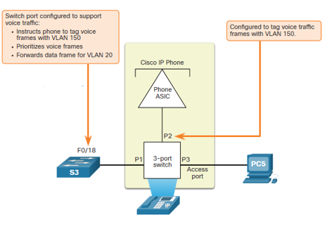

## 3.3 VLAN Configuration

### 3.3.1 VLAN Ranges on Catalyst Switches

- Normal Range VLAN 1 - 1005
    - gebruik in klein tot medium grootte bedrijven
    - 1002 - 1005 zijn gereserveerd voor legacy VLANs
    - 1, 1002 - 1005 zijn automatisch gegenereerd en kunnen niet verwijderd worden
    - bewaard in de vlan.dat file in flash geheugen
    - VTP kunnen gesynchroniseerd worden tussen de switches
- Extended Range VLAN 1006 - 4095
    - gebruikt door Service Providers
    - zitten in running-config
    - ondersteunen minder VLAN features
    - heeft VTP configuraties nodig

### 3.3.2 VLAN Creation Commands

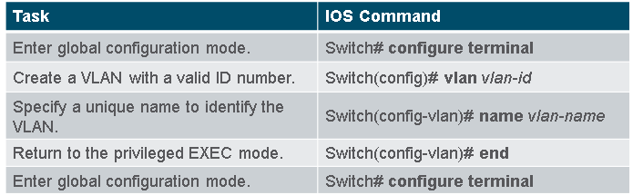

### 3.3.3 VLAN Creation Example

### 3.3.4 VLAN Port Assignment Commands

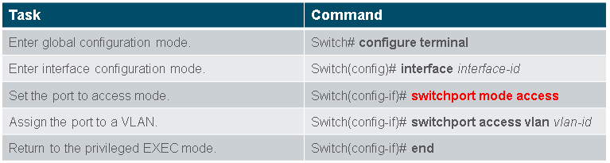

### 3.3.5 VLAN Port Assignment Example

### 3.3.6 Data and Voice VLANs

⇒ een access poort mag alleen maar verbonden zijn met 1 data VLAN

MAAR het mag ook verbonden zijn aan 1 Voice VLAN wanneer er een telefoon aan

### 3.3.7 Data and Voice VLAN Example

### 3.3.8 Verify VLAN Information

```bash
show vlan [brief | id vlan-id | name vlan-name | summary]
```

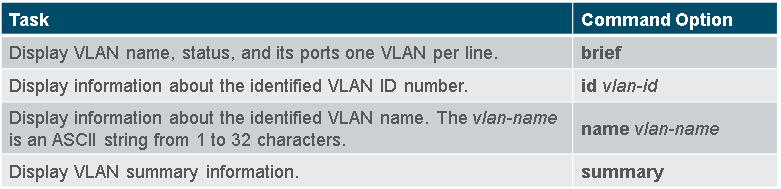

### 3.3.9 Change VLAN Port Membership

- verschillende manieren om VLAN membership te veranderen
    - switchport access vlan vlan-id command opnieuw invoeren
    - `no switchport access vlan` om interface terug te veranden naar VLAN 1
- via show vlan brief of show interface fa0/18 switchport om te verifiëren of dit de juist VLAN associatie is

### 3.3.10 Delete VLANs

- via `no vlan vlan-id` command
- !!! Vergeet niet alle leden poorten te veranderen naar een andere VLAN
- delete alle VLANs met `delete flash:vlan.dat` of `delete vlan.dat`
- reload de switch wanneer je een VLAN verwijderd hebt

## 3.4 VLAN Trunks

### 3.4.1 Trunk Configuration Commands


### 3.4.2 Trunk Configuration Example

### 3.4.3 Verify Trunk Configuration

- via `show interface fa0/1 switchport`
    - Administratively mode ⇒ trunk
    - operational mode ⇒ trunk
    - encapsulation ⇒ dot1q
    - Native VLAN ⇒ VLAN 99
    - alle VLANs gemaakt op deze switch zal dit traffic op deze trunk

### 3.4.4 Reset the Trunk to the Default State

- het resetten van de default trunk instellingen gebeurt via de no commando's (via de interface instellingen)
    - `no switchport trunk allowed vlan`
    - `no switchport trunk native vlan`
- all VLANs zijn toegelaten om te passeren
- Native VLAN = VLAN 1
- verifiëren via `show interface fa0/1 switchport`
- het resetten van de trunk in een access mode via `switchport mode access` commando

## 3.5 Dynamic Trunking Protocol

### 3.5.1 Introduction to DTP

- DTP (Dynamic Trunking Protocol) = proprietair Cisco protocol
- eigenschappen
    - aan in default op Catalyst 2960 en 2950 switches
    - Dynamic-auto is default aan op de 2960 en 2950 switches
    - mag uitgezet worden via de nonegotiate commando
    - mag aangezet worden bij de instellingen van de interface naar dynamic-auto

### 3.5.2 Negotiated Interface Modes

- de switchport mode commando heeft meer opties

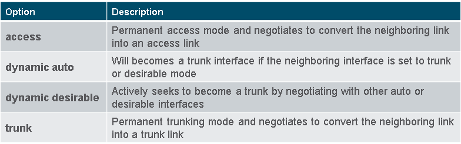

### 3.5.3 Results of a DTP Configuration

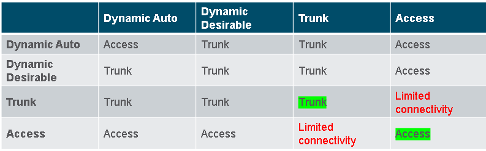

### 3.5.4 Verify DTP Mode

- de default configuratie van DTP is afhankelijk van de Cisco IOS versie en platform
    - gebruik `show dtp interface` om DTP mode te weten

# Module 4: Inter-VLAN Routing

## 4.1 Inter-VLAN Routing Operation

### 4.1.1 What is Inter-VLAN Routing?

- = het process van forwarding netwerk verkeer van de ene VLAN naar de andere VLAN
- Er zijn 3 inter-VLAN Routing optie
    - Legacy Inter-VLAN routing: legacy oplossing,
    - Router-on-a-Stick: goed voor kleine- tot middelgrote netwerken
    - Laag 3 switch met switched virtual interfaces (SVIs): best voor middelgrootte tot grote organisaties

### 4.1.2 Legacy Inter-VLAN Routing

- gebaseerd op het gebruik van een router met meerdere Ethernet interfaces
- de router interfaces wordt gebruik als de default gateways van de lokale hosts op het VLAN subnet
- iedere router interface is geconnecteerd met een switch poort in verschillende VLANs
- er zitten hierdoor wel limitaties op
- ! wordt niet meer langer geïmplementeerd in switches netwerken

### 4.1.3 Router-on-a-Stick Inter-VLAN Routing

- gebruikt maar 1 fysieke Ethernet interface om netwerkverkeer te versturen tussen verschillende VLANs op het netwerk
    - de Cisco IOS router Ethernet interface is ingesteld als de 802.1Q trunk en is geconnecteerd met de trunk poort op een Laag 2 Switch


### 4.1.4 Inter-VLAN Routing on a Layer 3 switch

- de moderne methode om inter-VLAN routing te implementeren is het gebruik maken van Laag 3 switches en Switched Virtual Interfaces (SVI)
- SVI = een virtuele interface dat geconfigueerd is op een laag 3 switch, zoals getoond op de figuur

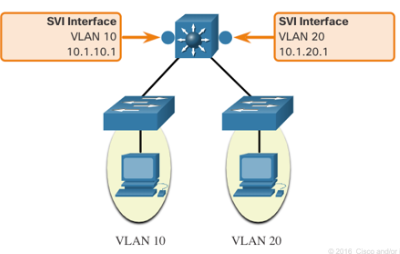

- Inter-VLAN SVIs zijn op dezelfde manier geïmplementeerd zoals de management VLAN interface
- de voordelen hiervan:
    - sneller
    - geen nood voor externe links van de switch naar de router
    - lagere latency
    - het meest gebruik op een campus LAN dan router
- nadeel ⇒ het is duurder

### 4.1.5

## 4.2 Router-on-a-Stick Inter-VLAN Routing

### 4.2.1 Router-on-a-Stick Scenario

### 4.2.2 S1 VLAN and Trunking Configuration

## 4.3 Inter-VLAN Routing using Layer 3 Switches

### 4.3.1 Layer 3 Switch Inter-VLAN Routing

- een grote onderneming heeft een sneller en betere methode nodig voor inter-VLAN routing
- er wordt gebruik gemaakt van Laag 3 Switches, Laag 3 switches gebruikt hardware-based switching om een grotere packet processing rate te krijgen dan routers
- de mogelijkheden van een Laag 3 Switch:
    - route van de ene VLAN naar een andere VLAN door gebruik te maken van meerder Switched Virtual Interfaces (SVIs)
    - converteert een laag 2 switchpoort naar een laag 3 interface, een routed poort is ongeveer hetzelfde als een fysieke interface op een Cisco IOS router

## 4.4 Troubleshoot Inter-VLAN Routing

### 4.4.1 Common Inter-VLAN Issues

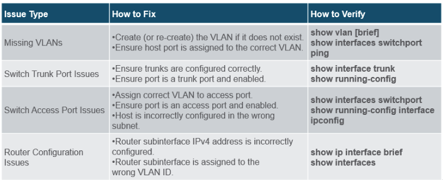

# Module 5: STP Concepts

## 5.1 Purpose of STP

### 5.1.1 Redundancy in Layer 2 Switched Networks

- Ethernet LANs hebben een loopvrije topologie met een single pad tussen 2 apparaten nodig

### 5.1.2 Spanning Tree Protocol

- STP = een loop preventie netwerk protocol dat het toelaat voor redundantie om terwijl een laag 2 topologie te maken
- STP blokt fysieke loops in een laag 2 netwerk om frames tegen te houden tegen het cirkelen op het netwerk voor altijd

### 5.1.3 STP Recalculation

- STP compenseert voor een fout in het netwerk door het opnieuw uit te reken en andere poorten opnieuw openen die geblokkeerd waren

### 5.1.4 Issues with Redundant Switch Link

- de mogelijkheid tot single point of failure te elimineren

### 5.1.5 Layer 2 Loops

- zonder STP, kunnen er ook Layer 2 loops ontstaan. Hierdoor kan er broadcast, multicast en onbekende unicaste frames zonder te stoppen loopen ⇒ kan heel snel een netwerk neer leggen
- wanneer dit gebeurt ⇒ MAC adres tabel van de switch zal constant veranderen met de updates van de broadcast frames ⇒ resulteert in MAC database instabiliteit
- een onbekend unicast frame = wanneer de switch niet het bestemming MAC-adres heeft in zijn MAC adres tabel

### 5.1.6 Broadcast Storm

- = een abnormaal hoog aantal aan broadcast dit het netwerk overwelmen in een bepaalde tijd. Het kan een netwerk stilleggen in minder dan seconden
    - kunnen veroorzaakt worden door hardware problemen (zoals kapotte NIC of Layer 2 loop in het netwerk)
- een host in een Layer 2 loop kan niet worden aangesproken door andere hosts op het netwerk hierbij weet de switch ook niet naar welke poort te forwarden (de unicast frames)

### 5.1.7 The Spanning Tree Algorithm

- STP is gebaseerd op het algoritme gemaakt door Radia Perlman
    - haar spanning tree algorithm (STA) maakt een loop-vrije topologie door het selecteren met een single root bridge waar alle  andere switches een single leastcoast pad vastlegt.
- STP stopt loop van opkomen door het opstellen van loop-vrij pad door het netwerk door stragisch "blocking-state" ports
- Hoe?
    - Selecteer een Root Bridge: het referentie punt voor het hele netwerk om een spanning tree rond te bouwen. Iedere switch zal een single cost path bepalen van zichzelf naar de root bridge
    - het blokkeren van Redunante wegen: STP verzekeren dat er maar 1 logische weg is naar alle bestemmingen op het netwerk door het intentieel blokkeren van redundante wegen dat een loop kan geven.
    - Maak een Loop-vrije topologie:
    - herbereken in geval van Link Failure

## 5.2 STP Operations

### 5.2.1 Steps to a Loop-Free Topology

1. bepaal de root bridge
2. bepaal de root poorten
3. bepaal de designated poorten
4. bepaal de alternatieve (geblokeerde) poorten
- tijdens het STP-proces gebruiken switches het Bridge Protocol Data Units (BPDUs) om informatei over zichzelf hen hun verbindingen te delen om zo de 4 stappen tot een goed einde te brengen
- elke BPDU bevat een Bridge ID (BID) dat de switch identificeert die de BPDU verzendt
    - de BID is belangrijk bij het bepalen van de root bridge en poortrollen

### 5.2.2 De Bridge ID (BID)

- de BID bestaat uit:
    - Bridge priority: de standaard priority waarde voor alle Cisco switches = 32768
        - de range is 0 → 61440 (in stukken van 4096)
        - de lager de beter
        - BP = 0 → neemt voorrang op alle andere BP's
    - Extended System ID: extended system ID waarde = een decimale waarde die aan de BP wordt toegevoegd om een VLAN te identificeren for deze BPDU
    - MAC Address

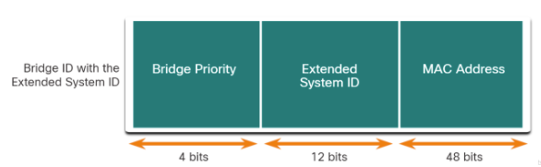

### 5.2.3 Stap 1: Bepaal de root bridge

- de switch met de laagste BID ⇒ root bridge
- werking:
    - nadat een switch is opgestart, verzend deze elke 2 sec een BPDU frame met daarin zijn eigen BID en de Root ID (BID van de root bridge)
    - obv de ontvangen BPDU frames passen de switches de Root Id aan zodat de laagste BID als Root ID overblijft

### 5.2.4 Stap 2: Bepaal de root ports

- elke non-root switch, bepaalt 1 root poort
- gebeurt obv de internal root path cost ( = de som van alle poortkosten op het pad naar de root bridge)
- de default poortkosten:
    
    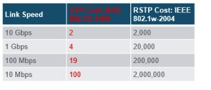
    

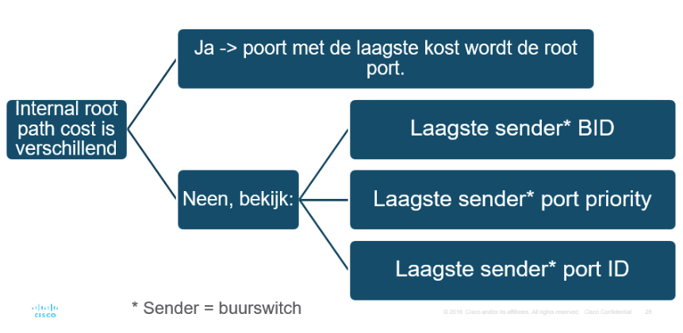

### 5.2.5 Stap 3: Bepaal de designated ports

- elke link zal 1 designated port krijgen
- alle poorten op de root bridge zijn designated ports
- als de ene poort op een link een root port is, wordt de andere poort een designated port
- alle poorten waaraan een host gekoppeld is, zijn designated ports
- op verbindingen tussen 2 non-root switches, wordt de poort met de laagste kost naar de root bridge de designated port.
    - bij gelijke kost naar de root bridge wordt de poort op de switch met de laagste BID de designated port
- alle designated porten komen in de forwarding state terecht

### 5.2.6 Stap 4: Bepaal de alternate (blocked) ports

- poorten die geen root of designated ports zijn,  worden alternate (of backup) ports
- alternate ports komen in een blocking state terecht

### 5.2.7 STP Timers en Port States

- STP heeft 3 timers nodig:
    - Hello Timer = het interval tussen 2 BPDUs. Standaars = 2 sec maar kan tussen de 0 en de 10 seconden
    - Forward Delay Timer = de tijd dat nodig is tussen de listening en de learning state. Standaard = 15 sec en kan veranderen tussen 4 en 30 seconden
    - Max Age Timer = de maximum lengte van tijd dat een switch wacht tussen het proberen van veranderen van STP topologie. Standaard = 20 sec maar kan veranderen tussen 6 en 40 seconden

### 5.2.8 Operational Details of Each Port State

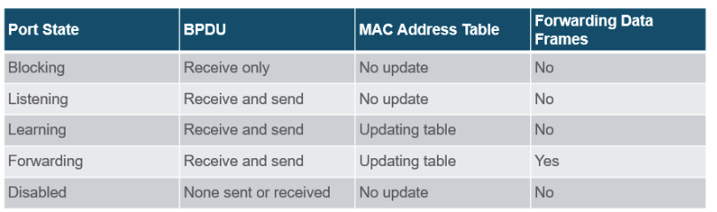

### 5.2.9 Per-VLAN Spanning Tree

- STP kan ingesteld worden om te werken in een omgeving met meerdere VLANs
- in Per-VLAN Spanning Tree (PVST), is er een root bridge aangesteld voor iedere spanning tree instance.
    - maakt het mogelijk om verschillende root bridge voor verschillende sets van VLANs

## 5.3 Evolution of STP

### 5.3.1 Different Versions of STP

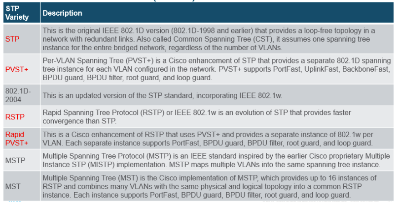

### 5.3.2 RSTP Concepts

### 5.3.3 RSTP Port States en Port Roles

- Port States:
    
    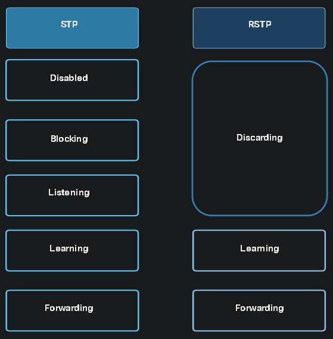
    
- Port Roles:
    
    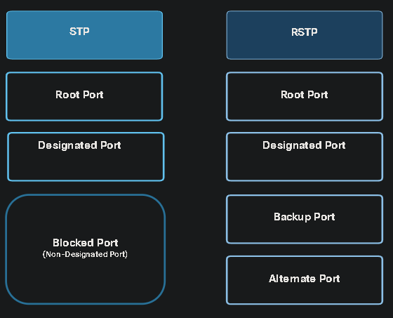
    
- Alternate en Backup Ports:
    
    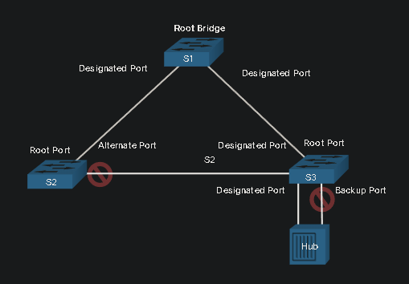
    

### 5.3.4 PortFast and BPDU Guard

- wanneer switch poort geconfigueerd is met PortFast
- een switchpoort met PortFast enabled ⇒ kan nooit BPDUs ontvangen

# Module 6: EtherChannel

## 6.1 EtherChannel Operation

### 6.1.1 Link Aggregation

- in sommige scenario's is het mogelijk om een extra link te leggen voor meer bandbreedte en redundantie
- maar door STP (Spanning Tree Protocol) wil deze link blokkeren om switching loop te voorkomen

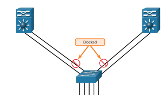

- EtherChannel wordt gebruikt om tegen te gaan dat het niet geblockt wordt door STP
- EtherChannel = link aggregatie technologie dat meerder ethernet links samenvoegt tot 1 logische link

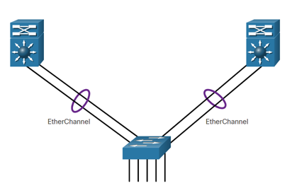

### 6.1.2 EtherChannel

- EtherChannel technologie is orgineel gemaakt door Cisco als een LAn switch-to-switch techniek om meerdere Fast Ethernet of Gigabit Ethernet poorten te groeperen tot 1 logisch kanaal
- wanneer EtherChannel geconfigueerd is, noemt de virtual interface die gecreeërd is **port channel**

### 6.1.3 Voordelen van EtherChannel

- de meeste configuraties kunnen gedaan worden via EtherChannel interface (port channel)
- EtherChannel vertrouwt op bestaande switch poorten, er is geen nood aan het upgraden van de link naar een sneller en duurdere connectie om meer bandbreedte te hebben
- load balancing gebeurd tussen de link die samen in hetzelfde EtherChannel
- EtherChannel geeft redundantie

### 6.1.4 Implementation Restrictions

- de interface types kunnen niet gemixed worden
- EtherChannel kan tot 8 Ethernet poorten bevatten. Full-duplex bandbreedte tot 800 Mbps (Fast EtherChannel) of 8 Gbps (Gigabit EtherChannel) tussen 2 switches of switch en host
- Cisco Catalyst 2960 Layer 2 support 6 EtherChannels
- de individuele EtherChannel groepslid pport configuratie moet consistent zijn tussen de 2 apparaten. Iedere poort op EtherChannel link moet geconfigueerd zijn als Laag 2 poorten
- iedere EtherChannel heeft een logische poort channel interface. een configuratie is gekoppeld aan de poort channel interface geeft op alle fysieke interfaces die gekoppeld zijn aan deze poort channel interface.

### 6.1.5 AutoNegotiation Protocols

- EtherChannels kunnen gevormd worden door 2 protocols. Deze protocollen zorgen ervoor dat dat poorten met dezelfde eigenschappen een channel vormen door dynamic negotiation met andere switches
    - Port Aggregation Protocol (PAgP)
    - Link Aggregation Control Protocol (LACP)

### 6.1.6 PAgP Operation

- is een cisco-prioricerende protocol dat het automatisch maken van EtherChannel links helpt
- Dit gebeurt door het versturen van pakketten tussen EtherChannel-capable poorten om het vormen van een channel te negotiaten
- Als dit ingesteld is, kan PAgP een EtherChannel beheren. PAgP-pakketten worden om de 30 seconden verzonderen om zo te controleren of de configuratie nog steeds dezelfde is.
- In EtherChannel, het is verplicht dat alle poorten dezelfde snelheid, duplex setting en VLAN informatie heeft.
- PAgP helpt het maken van EtherChannel link en dit wordt gedaan aan de had van verschillende modes:
    - **On:** plaatst de interface manueel in een EtherChannel zonder negotiation. ****
    - **PAgP desirable:** actieve negotiation
    - **PAgP auto**: passieve negotiation

### 6.1.7 PAgP Mode Settings Example

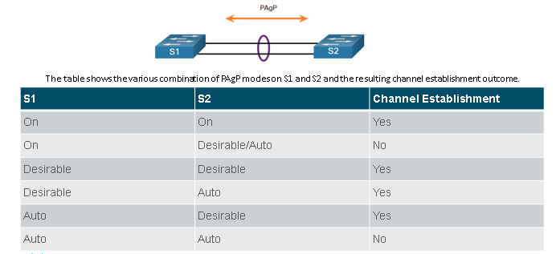

### 6.1.8 LACP Operation

- is een deel van IEEE specification (802.3ad) dat het toelaat om meerdere fysieke poorten te bundelen tot 1 logische channel
- LACP laat een switch toe op te onderhandelen om een automatische bundel te maken via LACP pakketen te versturen naar de andere switch
- modes van LACP:
    - On
    - LACP active
    - LACP passive

### 6.1.9 LACP Mode Setting Example

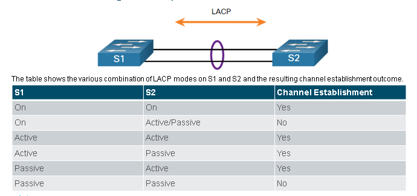

## 6.2 Configure EtherChannel
### 6.2.1 Configuration Guidelines

- EtherChannel Support: alle Ethernet interfaces moeten EtherChannel ondersteunen zonder dat het nodig is dat de interfaces
- Speed and duplex: configueerd alle interfaces zodat ze allemaal werken met dezelfde snelheid en dezelfde duplex mode
- VLAN match: alle interfaces moeten aan dezelfde VLAN
- Range of VLANs: EtherChannel ondersteunt dezelfde ranga aan VLANs op alle interfaces in a trunking EtherChannel

## 6.3 Verify and Troubleshoot EtherChannel
### 6.3.1 Verify EtherChannel

- een paar commando's
    - `show interfaces port-channel` ⇒ toont de general status van de port channel interface
    - `show etherchannel summary` ⇒ toont 1 lijn van informatie per poort channel
    - `show etherchannel port-channel` ⇒ toont informatie van een specifieke poort channel interface
    - `show interfaces etherchannel` ⇒ geeft informatie over de role van het fysieke lid interface van de EtherChannel

### 6.3.2 Common Issues with EtherChannel Configurations

- iedere interface op de EtherChannel moet dezelfde configuratie hebben (voor snelheid, duplex mode, native en toegelaten VLANs on trunks en toegang VLAN op de toegangspoorten
- Meest verkomende proberen met EtherChannel:
    - de poorten zijn geen deel van dezelfde VLAN

# Module 7: DHCPv4
## 7.1 DHCPv4 Concepten
### 7.1.1 DHCPv4 Server and Client

- Dynamic Host Configuration Protocol v4 (DHCPv4) geeft IPv4-adressen en andere netwerk-configuratie informatie dynamisch
- een dedicated DHCPv4 server is schaalbaar en tamelijk gemakkelijk te onderhouden

### 7.1.2 DHCPv4 Operation

- DHCPv4 werk in client/server mode. Wanneer een client communiceert met een DHCPv4 server, de server geeft of least a IPv4-adres aan dat client

### 7.1.3 Steps to Obtain a Lease

1. DHCP Discover (DHCPDISCOVER)
2. DHCP Offer (DHCPOFFER)
3. DHCP Request (DHCPREQUEST)
4. DHCP Acknowledgement (DHCPACK)

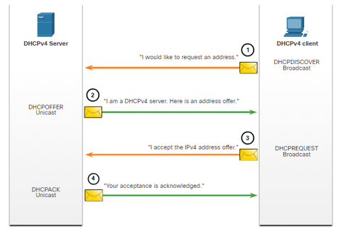

### 7.1.4 Steps to Renew a Lease

1. DHCP Request (DHCPREQUEST)
    1. voordat de lease vervalt, verstuurt de client een DHCPREQUEST
2. DHCP Acknowledgment (DHCPACK)

## 7.2 Configure a Cisco IOS DHCPv4 Server

### 7.2.1 Cisco IOS DHCPv4 Server

- een Cisco router kan ingesteld worden om te acten als DHCPv4 Server

### 7.2.2 Steps to Configure a Cisco IOS DHCPv4 Server

1. Stap 1: `ip dhcp exluded-address low-address [high-address]`
2. Stap 2: definieer een DHCPv4 pool naam:  `ip dhcp pool pool-name`
3. Stap 3: configueer DHCPv4 pool

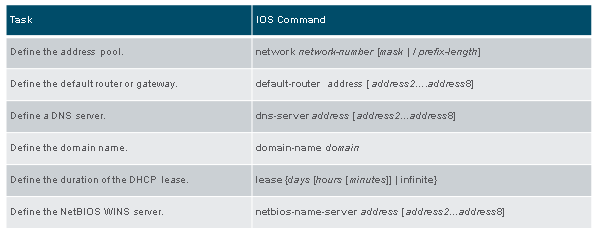

### 7.2.3 Configuration Example

### 7.2.4 DHCPv4 Verification

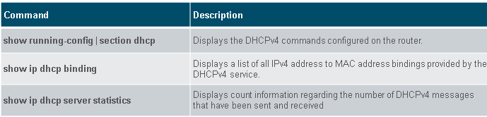

### 7.2.5 Verify DHCPv4 is Operational

### 7.2.6

### 7.2.7 Disable the Cisco IOS DHCPv4 Server

DHCPv4 service staat standaard aan

- `service dhcp` ⇒ service aanzetten
- `no service dhcp` ⇒ service uitzetten

### 7.2.8 DHCPv4 Relay

### 7.2.9 Other Service Broadcasts Relayed

- het commando `ip helper-address` forward volgende UDP services:
    - poort 37: Time
    - poort 49: TACACS
    - poort 53: DNS
    - poort 67: DHCP/BOOTP server
    - poort 68: DHCP/BOOTP client
    - poort 79: TFTP
    - poort 137: NetBIOS name service
    - poort 138: NetBIOS datagram service

## 7.3 Configure a DHCPv4 Client

### 7.3.1 Cisco Router as a DHCPv4 Client

- een Ethernet interface instellen als DHCP client ⇒ `ip address dhcp` , op de interface configuratie mode

### 7.3.2 Configuration Example

### 7.3.3 Home Router as a DHCPv4 Client

# Module 8: SLAAC and DHCPv6
## 8.1 IPv6 GUA Assignment
### 8.1.1 IPv6 Host Configuration

- op een router, een IPv6 global unicast address (GUA) is manueel geconfigueerd via het `ipv6 address ipv6-address/prefix-length` commando

### 8.1.2 IPv6 Host Link-Local Address

- als het automatisch addresseren van IPv6-adressen aanstaat ⇒ de host wil een Internet Control Message version 6 (ICMPv6) Router Advertisement (RA) message gebruikne om de IPv6 configuratie tot een goed eind te helpen
    - IPv6 link-local adres is automatisch aangemaakt door de host wanneer het boot en de Ethernet interface actief is

### 8.1.3 IPv6 GUA Assignment

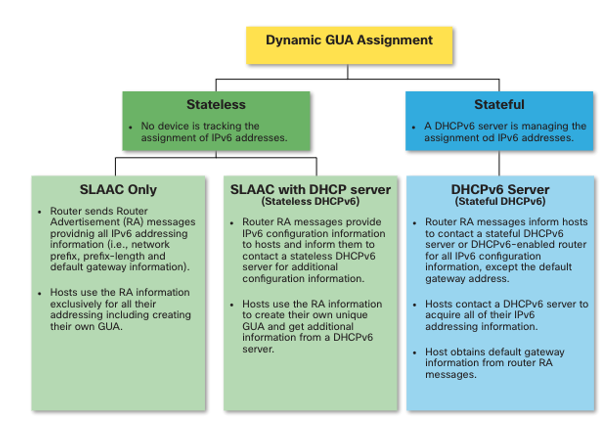

### 8.1.4 Three RA Message Flags

- een client krijgt zijn IPv6 GUA afhankelijk van de instellingen in de RA message
- een ICMPv6 RA bericht bevat 3 flags:
    - A flag: the Address Autoconfiguration flag geeft aan om Stateles Address Autoconfiguration (SLAAC) te maken voor een IPv6 GUA
    - O flag: The Other Configuration flag geeft aan dat de bijkomende informatie beschikbaar is van de stateless DCHPv6 server
    - M flag: The Managed Address Configuration flag geeft aan een stateful DHCPv6 server te gebruiken om een IPv6 GUA te verkrijgen

## 8.2 SLAAC
### 8.2.1 SLAAC Overview

- niet iedere netwerk heeft toegang tot een DHCPv6 server maar ieder aparaat in een IPv6 netwerk heeft een GUA nodig. Via de SLAAC methode geeft de mogelijkheid aan een host om zij eigen unieke IPv6 global unicast address zonder de diensten van een DHCPv6 server
    - SLAAC is een stateless dienst, dit betekent dat er geen server is om het netwerk te onderhouden over adres informatie om te weten welk IPv6 berichten er gebruikt worden en welke er beschikbaar zijn
    - SLAAC stuurt periodisch ICMPv6 RA berichten (iedere 200 seconden) om hierdoor addressing en andere configuratie informatie voor hosts om zo hun IPv6 adres te configureren aan de hand van de informatie uit de RA
    - een host kan een Router Solicitation (RS) bericht te versturen om zo een RA aan te vragen
    - SLAAC kan geconfigueerd worden als SLAAC only of SLAAC met DHCPv6

### 8.2.2 Enabling SLAAC

### 8.2.3 SLAAC Only Method

### 8.2.4 ICMPv6 RS Messages

- een router stuurt RA berichten ieder 200 seconden of wanneer hij een RS bericht ontvangt van de host
    - hosts met IPv6 die een IPv6 addresserings informatie wil stuurt een RS bericht naar de IPv6 routers met multicast adres van FF02::2

## 8.3 DHCPv6
### 8.3.1 DHCPv6 Operation Steps

- stateful DHCPv6 heeft geen SLAAC nodig, maar stateless DHCPv6 wel
- stappenplan
    - host stuurt een RS bericht
    - de router antwoordt met een RA bericht
    - de host stuurt een DHCPv6 SOLICIT bericht
    - de DHCPv6 server antwoordt met een ADVERTISE bericht
    - de host antwoord aan de DHCPv6
    - de DHCPv6 server stuurt een REPLY bericht

### 8.3.2 Stateless DHCPv5 Operation

- als een RA toont dat er sprake is van stateless DHCPv6 methode, de host gebruikt de informatie van de RA bericht voor de adressering en contacteert de DHCPv6 server voor meer informatie

### 8.3.3 Enable Stateless DHCPv6 on an Interface

- via het commando `ipv6 nd other-config-flag`, in de interface configuratie pagina, zet O flag → 1

### 8.3.4 Stateful DHCPv6 Operation

- als een RA aantoont dat de stateful DHCPv6 methode gebruikt wordt, de host contacteert een DHCPv6 server voor alle configuratie informatie, maar niet de default gateway

### 8.3.6 Enable Stateful DHCPv6 on an Interface

- via commando `ipv6 nd managed-config-flag` in de interface configuratie pagina
- `ipv6 nd prefix default no-autoconfig` zet SLAAC uit door A flag te veranderen naar 0

## 8.4 Configure DHCPv6 Server

### 8.4.1 DHCPv6 Router Roles

- DHCPv6 Server: router geeft een stateless or stateful DHCPv6 diensten
- DHCPv6 Client: router interface krijgt een IPv6 IP configuratie van een DHCPv6 server
- DHCPv6 Relay Agent: router geeft DHCPv6 forwarding diensten wanneer de client en de server zich op verschillende netwerken bevinden

### 8.4.2 Configure a Stateless DHCPv6 Server

- de stateless DHCPv6 server option geeft aan dat de router
- 5 stappen om een router in te stellen als een stateless DHCPv6 server
    - zet IPv6 routing aanzetten via `ipv6 unicast-routing`
    - stel een DHCPv6 pool name door `ipv6 dhcp pool POOL-NAME`
    - configueer de DHCPv6 pool met opties, common opties zijn `dns-server X:X:X:X:X:X:X:X` en `domain-name name`
    - hangt de interface aan de pool via `ipv6 dhcp server POOL-NAME`
    - verifieer dat de host IPv6 adressering hebben gekregen via `ipconfig /all`

### 8.4.3 Configure Stateless DHCPv6 Client

- een router kan ook als een DHCPv6 client gedragen
    - enable IPv6 routing via `ipv6 unicast-routing`
    - configueer de client router om een LLA te maken
    - configueer de client router om SLAAC te gebruiken via `ipv6 address autoconfig`
    - verifieer dat de client router is gelinkt met een GUA via `show ipv6 interface brief`
    - verifieer dat de client router de ander DHCPv6 informatie krijgt, `show ipv6 dhcp interface g0/0/1` confirmeert  de DHCP optie informatie

### 8.4.4 Configure a Stateful DHCPv6 Server

- een stateful DHCP server optie
- de vijf stapen
    - enable IPv6 routing via `ipv6 unicast-routing`
    - definieer een DHCPv6 pool name via `ipv6 dhcp pool POOL-NAME`
    - configueer een DHCPv6 pool met opties
    - link de interface met de pool via `ipv6 dhcp server POOL-NAME`
    - verifieer dat de host IPv6 adressing hebben ontvangen via `ipconfig /all`

### 8.4.5 Configure a Stateful DHCPv6 Client

- een router kan ook een DHCPv6 client zijn, hiervoor moet ipv6 unicast-routing aantaan en een IPv6 link-local adres hebben
- 5 stappen om een router als stateless DHCPv6 client te configueren en verifiëren
  - zet IPv6 routing aan, via `ipv6 unicast-routing`
  - gebruik commando `ipv6 enable`
  - `ipv6 address dhcp`
  - verifieer via `show ipv6 interface brief`
  - verifieer andere informatie via `show ipv6 dhcp interface g0/0/1`
### 8.4.6 DHCPv6 Server Verification Commands

- `show ipv6 dhcp pool`
- `show ipv6 dhcp binding`

### 8.4.7 Configure a DHCPv6 Relay Agent

- via het commando `ipv6 dhcp relay destination <ipadres>`

### 8.4.8 Verify the DHCPv6 Relay Agent

- `show ipv6 dhcp interface`
- `show ipv6 dhcp binding`

# Module 9: FHRP Concepts
## 9.1 First Hop Redundancy Protocols
### 9.1.1 Default Gateway Limitations

- end-apparaten zijn ingesteld met een single default gateway IPv4 address
    - als de default gateway router interface niet lukt,
- First Hop Redundancy Protocols (FHRPs) zijn mechanismen dat alternate dafault gateways geeft in switched netwerken waar er 2 of meer router geconnecteerd zijn met dezelfde VLANs

### 9.1.2 Router Redundancy

- 1 manier om single point of failure weg te krijgen is om een virtual router
- om dit te implementeren, meerdere routers de illusie geven dat ze als 1 router werken naar de hosts op de LAN, door een IP adres te delen en een MAC adres
    - een IPv4 adres van de virtual router is geconfigueerd als de default gateway
    - wanneer er frames verstuurt worden van de host apparaten naar de default gateway. De host gebruiken ARP om het MAC adres te achterhalen dat geassocieerd is met de IPv4 adres van de default gateway. De ARP resolutie geeft het MAC adres terug van de virtual router, deze frames worden dan fysiek verwerkt door de actieve router
    - een protocol wordt gebruikt om 2 of meer router te identificeren als de aparaten die verantwoordelijk zijn voor het verwerken van de frames die verstuurt zijn naar het MAC of IP adres van en single virtual router. Host apparaten stuurt het verkeer naar het adres van de virtual router. De fysieke router dat het verkeer doorstuurt is het transparent naar de host apparaten
    - een redunantie protocol geeft het mechanism om te bepalen welke router de actieve rol opneemt in het doorsturen van het verkeer.
    - de mogelijkheid dat een netwerk dynamisch hersteld van een failure van een aparaat die als default gateway werkt ⇒ first-hop redundancy

### 9.1.3 Steps for Router Failover

- wanneer de actieve router faalt, de redundantie protocol stelt de standby router als de nieuwe actieve router. Dit zijn de stappen
    - de standby router stopt met Hello berichten te zien van de forwarding router
    - de standby router neemt de rol over van de forwarding router
    - omdat de nieuwe forwarding router dezelfde IPv4 en MAC adres hebben van de virtual router, is er geen disruptie van de dienst

### 9.1.4 FHRP Options

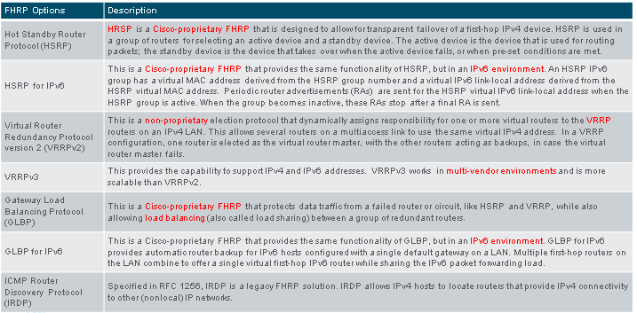

## 9.2 HSRP
### 9.2.1 HSRP Overview

- Cisco geeft HSRP en HSRP voor IPv6 als een manier om tegen te gaan dat je outside netwerk access verliest wanneer je default router faalt.
- HSRP verzekerd hoge netwerk beschikbaarheid door een first-hop routing redundancy voor de IP host op de netwerken met een IP default gateway address

### 9.2.2 HSRP Priority and Preemption

- de rol van de actieve en standby router is vastgesteld tijdens de HSRP election proces
- by default, wordt de router met de meeste IPv4 adressen de nieuwe actieve router
- HSRP priority kan gebruikt worden om de actieve router de kiezen
- de router met de hoogste HSRP priority wordt de nieuwe actieve router
- by default is de HSRP Priority = 100
- als de priority gelijk zijn, wordt de router met de hoogste IPv4 adresen de nieuwe actieve router
- om een router te configueren als de actieve router, `standby priority` interface command, range: 0-255

### 9.2.3 HSRP States and Times

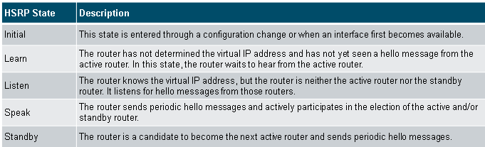

# Module 10: LAN Security Concepts
## 10.1 Endpoint Security
### 10.1.1 Network Attacks Today

- Distributed Denial of Service (DDoS): een gecoördineerde aanval 
- Data Breach
- Malware

### 10.1.2 Network Security Devices

- Virtual Private Network (VPN) enabled router
- Next-Generation Firewall (NGFW)
- Network Access Control (NAC), bevat AAA diensten; authentication, authorization en accouting

### 10.1.3 Endpoint Protection

- endpoints zijn hosts die meestal bestaan uit laptops, desktops, servers en IP-telefonen
- endpoints hebben typisch een traditionele host-gebaseerde security features: 
  - antivirus/antimalware
  - host-gebaseerde firewalls
  - host-gebaseerde intrusion preventie systemen (HIPSs)
- hosts zijn het best beveiligd door een combinatie van NAC, AMP software, een email security appliance (ESA) en een web security appliance (WSA)

### 10.1.4 Cisco Email Security Appliance

- de Cisco ESA apparaat is gemaakt om Simple Mail Transfer Protocol (SMTP) te monitoren
- maakt gebruikt van Cisco Talos, deze detecteert gevaren en oplossingen door gebruik te maken van een wereldwijde databank monitor systeem
- functies van de Cisco ESA
    - het blokkeren van bekende threats
    - email met slechte links verwijderen
    - encrypteer inhoud van een uitgaande mail om data loss tegen te gaan
    - toegang blokkeren to nieuwe geïnfecteerde websites

### 10.1.6 Cisco Web Security Appliance

- Cisco Web Security Appliance (WSA) is een beperkingstechnologie voor webgebaseerde bedreigingen
- Cisco WSA combineert de geavanceerde malware bescherming, applicatie zichtbaarheid en controle,
- Cisco WSA geeft een volledige controle over hoe gebruikers het internet gebruiken
  - sommige applicatie kunnen toegelaten worden
  - met restrictie van tijd en bandbreedte
  - afhankelijk van de noden van de organisatie
- maak een blacklist bij van URLs
  - URL-filtering
  - malware scanning
  - URL categorisering

## 10.2 Access Control
### 10.2.1 Authentication with a Local Password

- verschillende types van authenticatie
    - login en wachtwoord combinatie op console, vty lines en aux poorten
    - SSH is een veiligere methode voor remote access
- een lokale database methode heeft limitaties
    - geen fallback authenticatie methode
    - moet op ieder apparaat apart geconfigueerd worden => niet schaalbaar

### 10.2.2 AAA Components

- AAA staat voor Authenticatie, Authorizatie en Accounting
    - authencatie: wie ben je?
    - authorisatie: wat kun je doen?
    - accounting: controle wat je doet

### 10.2.3 Authenticatie

- 2 manieren om AAA Authentication te implementeren
    - local
        - steekt usernames en wachtwoorden lokaal op een netwerk apparaten
        - ideaal voor kleine netwerken
        - gebruikers authenticeren tegen een lokale databank
    - server-based
        - de router krijgt toegang tot een centrale AAA server
        - de AAA server houd de usernames en wachtwoorden bij
        - de router gebruikt ofwel
            - Remote Authentication Dial-In User Service (RADIUS)
            - Terminal Access Controller Access Control System (TACACS+)

### 10.2.4 Authorization

- gebeurt automatisch
- geeft aan wat gebruikers wel en niet kunnen doen om het netwerk na de authenticatie
- gebruikt een set van attributen dat de toegang van de gebruikers vastlegd, en bepaald de privileges en restricties van een gebruiker

### 10.2.5 Accounting

- accounting verzamelt en reports gebruikdata

### 10.2.6 802.1X

de **IEEE 802.1X** standaard is een poort gebaseerd access control en authentication protocol, dit protocol beperkt ongeautoriseerde workstation om te connecteren tot de LAN via publieke switch poorten

- specieke rollen van de apparaten in een 802.1X poort-gebaseerde authenicatie:
    - client (suppllicant): een apparaat die 802.1X-compliant client software draait
    - switch (authenticator): 
    - authentication server

## 10.3 Layer 2 Security Threats
### 10.3.1 Layer 2 Vulnerabilities

- als Layer 2 gecompromiseerd is, zijn alle lagen erboven ook gecompromiseerd

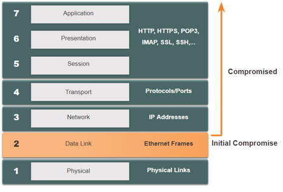

### 10.3.2 Switch Attack Categories

- de beveiliging is even sterk als de slechtste link in het systeem => laag 2 wordt gezien als de slechtse link
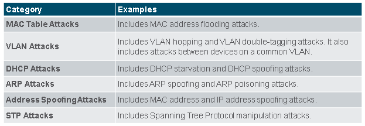

### 10.3.3 Switch Attack Mitigation Techniques


- deze oplossingen zullen niet effectief zijn als de management protocols niet beveiligd zijn
- volgende strategies zijn aanbevolen:
    - beveiligde varianten gebruiken van management protcollen zoals SSH, Secure Copy Protocol (SCP), Secure FTP (SFTP) en Secure Socket Layer/Transport Layer Security (SSL/TLS)
    - gebruikt een dedicated management VLAN
    - gebruikt ACLs om unwanted access te filteren
    - gebruikt out-of-band management netwerk om aparaten te beheren

## 10.4 MAC Address Table Attack
### 10.4.1 Switch Operation Review
- een Layer2 LAN switch maakt een tabel gebaseerd op de bron MAC adressen in ontvangen frames = MAC-adres tabel
- deze wordt opgeslagen in het geheugen

### 10.4.2 MAC Address Table Flooding
- iedereen MAC tabellen hebben een vaste grootte 
- bij MAC-adres tabel flooding attacks stuurt de hacker een grote groep fake bron MAC-adressen zodat de MAC-adres tabel vol is
- wanneer dit gebeurt zal de switch iedere frame behandelen als een onbekend unicast en zal hij ieder inkomend verkeer naar alle poorten op hetzelfde VLAN zonder te kijken naar het MAC-adres

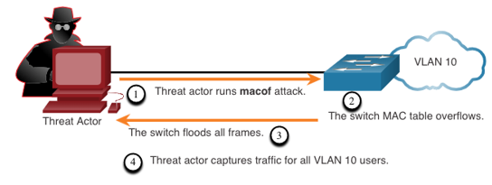

### 10.4.3 MAC Address Table Attack Mitigation
- een tool zoals macof is gevaarlijk want het kan een MAC-adres tabel overflooding met MAC-adressen in een paar seconden
- om dit tegen te gaan moeten de network administrators port security implementeren

## 10.5 LAN Attacks
### 10.5.2 VLAN Hopping Attacks
- een VLAN hopping attack laat toe om netwerkverkeer van een ene VLAN te kunnen bekijken van een andere VLAN zonder de hulp van een router
- de hacker configueert een host om te doen alsof ze een switch is, door een voordeel te nemen uit de automatische trunking port feature

### 10.5.3 VLAN Double-Tagging Attacks
- verschillende stappen
  - **stap 1**: de hacker stuurt een double-tagged 802.1Q frame naar de switch, de outer header heeft de VLAN tag van de hacker, deze is dezelfde als de native VLAN van de trunk poort
  - **stap 2**: de frame arriveert op de eerste switch, deze lijkt op de eerste 4-byte 802.1Q tag
  - **stap 3**: 
- VLAN Attack Mitigation
  - disable trunking op alle toegangspoorten
  - disabel auto trunking on trunk links zodat trunks manueel aangezet moeten worden
  - maak zeker dat de native VLAN alleen gebruikt wordt voor trunk links

### 10.5.4 DHCP Messages
- DHCP server geven dynamisch IP configuratie informatie, IP-adres, default gateway, DNS server
- 
### 10.5.5 DHCP Attacks
- 2 types van DHCP aanvallen
  - **DHCP Starvation Attack**
  - **DHCP Spoofing Attack**
    - dit gebeurt wanneer er een vreemd DHCP server aan het netwerk geconnecteerd is, en valse IP configuratie parameter geeft aan legitieme client
      - verkeerde default gateway
      - verkeerde DNS server
      - verkeerd IP-adres
- mitigated door het implementeren van DHCP snooping

### 10.5.7 ARP Attacks

### 10.5.8 Address Spoofing Attacks

### 10.5.9 STP Attack
- aanvallers kunnen het Spanning Tree Protocol (STP) manipuleren zodat 
- mitigated door het implementeren van BDPU guard op alle toegangspoorten
- 
### 10.5.10 CDP Reconnaissance
- CPD is een proprietaire layer link discovery protocol

# Module 11: Switch Security Configuration
## 11.1 Implement Port Security
### 11.1.1 Secure Unused Ports
- alle switch poorten (interfaces) moeten beveiligd worden voordat de switch gebruitk word voor productie-gebruik
- een simpele methode is om de ongebruikte poorten uitzetten, via `shutdown` commando
- om een grote range van poorten te configureren, kun je de `interface range` commando

### 11.1.2 Mitigate MAC Address Table Attacks
- de simpelste en meest effectieve manier om MAC-adres overflow aanvallen tegengaan is om poort-beveiliging 
  - poort-beveiliging limiteert de aantal juiste MAC adressen die toegelaten zijn op een poort. Dit maakt dat een admin de mac adressen manueel geconfigueerd kunnen worden voor een poort
  - door het aantal van toegelaten MAC-adressen

### 11.1.3 Enable Port Security
- poort beveiliging gebeurt met de `switchport port-security` interface commando
- `show port-security`

### 11.1.4 Limit and Learn MAC Addresses
- om een maximum aantal MAC-adres toe te laten op een poort, gebruikt volgend commando:
  - `switchport port-security maximum <value>`
  - de standaard waarde is 1
  - de maximum aantal van beveiligde MAC-adressen dat geconfigueerd kunnen worden is afhankelijk van de switch en de iOS
- de configuratie over het leren van MAC-adressen op een beveiligde poort kan op 3 verschillende manieren
  - manueel geconfigueerd: met volgende commando: `switchport port-security mac-address <mac-address>`
  - dynamisch geleerd
  - dynamisch geleerd - sticky: aanzetten met volgend commando: `switchport port-security mac-address sticky`

### 11.1.5 Port Security Aging
- 
### 11.1.6 Port Security Violation Modes

### 11.1.7 Ports in error-disabled State
### 11.1.8 Verify Port Security

## 11.2 Mitigate VLAN Attacks
### 11.2.1 VLAN Attacks Review
### 11.2.2 Steps to Mitigate VLAN Hopping Attacks
- **Stap 1**: zet DTP onderhandelingen op niet-trunking uit via `switchport mode access`, interface configuratie commando
- **Stap 2**: zet ongebruikte poorten uit en zet ze in niet gebruikte VLAN
- **Stap 3**: zet de trunk link op een trunking poort manueel aan door het `switcport mode trunk` commando
- **Stap 4**: zet DTP (auto trunking) onderhandelingen op de trunking poorten uit door het `switchport nonegotiate` commando
- **Stap 5**: zet de native VLAN op een VLAN anders dan VLAN1, door `switchport trunk native vlan <vlan_number>`, gebruikt de native VLAN niet als de data VLAN

## 11.3 Mitigate DHCP Attacks
### 11.3.1 DHCP Attack Review
- DHCP Starvation Attack
- DHCP Spoofing Attack

### 11.3.2 DHCP Snooping
### 11.3.3 Steps to Implement DHCP Snooping
- **Stap 1**: zet DHCP snooping aan met `ip dhcp snooping` globale configuratie commando
- **Stap 2**: op trusted poorten, gebruikt het `ip dhcp snooping trust` commando
- **Stap 3**: op untrusted interfaces, limiteer het aantal DHCP discovery berichten dat kan ontvangen worden door het `ip dhcp snooping limit rate <packet-per-second>` commando
- **Stap 4**: zet DHCP snooping door VLAN aan, via `ip dhcp snooping <vlan>` commando

### 11.3.4 DHCP Snooping Configuration Example

## 11.4 Mitigate ARP Attacks
### 11.4.1 Dynamic ARP Inspection
- Dynamic ARP inspection (DAI) vereist DHCP snooping en help ARP aanvallen tegen te gaan door:
  - 
### 11.4.2 DAI Implementation Guidelines
- guidelines
  - zet globale DHCP snooping aan
  - zet DHCP snooping aan op geselecteerde VLANs
  - zet DAI aan op geselecteerde VLANs
  - configueer vertrouwde interfaces voor de DHCP snooping en ARP inspectie
### 11.4.3 DAI Configuration Example

## 11.5 Mitigate STP Attacks
### 11.5.1 PortFast and BPDU Guard
- PortFast
  - PortFast brengt een poort onmiddelijk naar de forwarding state
  - zet dit op alle end-user toegangspoorten
- BPDU Guard
  - zet onmiddelijk error disables een poort dat een BPDU ontvangt
  - moet enkel maar geconfigueerd op de interfaces die aan de end-apparaten

### 11.5.2 Configure PortFast
- zet PortFast enkel aan op toegangspoorten
- kan aangezet worden door:
  - op een interface: `spanning-tree portface` interface configuratie commando
  - globaal: `spanning-tree portfast default` globale configuratie commando, om PortFast aan te zetten op alle toegangspoorten
- om de configuratie te verifiëren
  - `show running-config | begin span`
  - `show spanning-tree summary`

### 11.5.3 Configure BPDU Guard
- geconfigueerd worden door:
  - op een interface: `spanning-tree bpduguard enable`
  - globaal: `spanning-tree portfast bpduguard default`